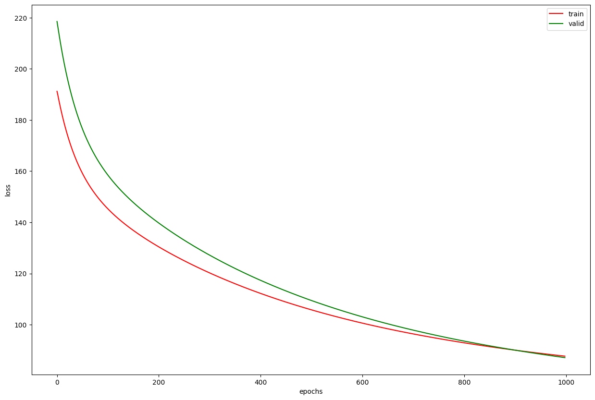

# ABOUT
this is a very simple implementation of Linear Regression using L2 OR L1 regularization .
the model is implemented in the model.py file . to use the model you can run the main.ipynb file.
# DATA USED
The Data used for this model is boston house prices . you can any other data but remember that this model only accepts numerical data.
# RESULTS
this is a diagram that shows the loss of model in every epoch with the initial setting
